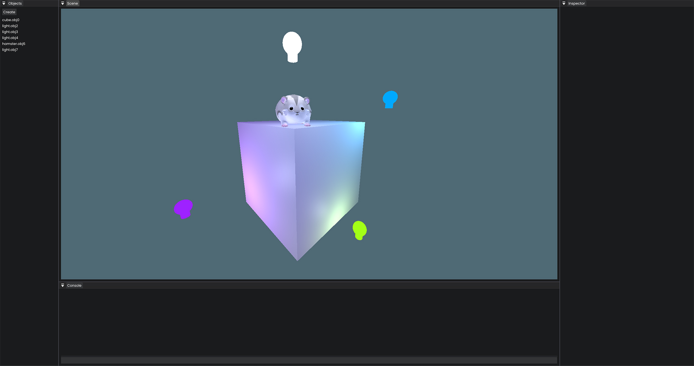

# Lean Renderer

3D OpenGL Renderer written in modern C++ supported by an [imgui](https://github.com/ocornut/imgui) interface. The goal is to create a 3D playground that allows users to import 3D models and implement various graphics features. At this current moment, these are the following features...

- Import 3D textured models using [assimp](https://github.com/assimp/assimp)
- Phong lighting
- Material lighting properties
- Multiple light sources
- Transform, rotate, and scale models using an imgui [gizmo](https://github.com/CedricGuillemet/ImGuizmo)
- Object selection/picking
- Modify the rendering of the 3D model (i.e wireframe, colour, etc.)




## Building

```bash
mkdir build
cd build
cmake ..
make
```

## Libraries

- [glad](https://github.com/Dav1dde/glad)
- [glm](https://github.com/g-truc/glm)
- [glfw](https://github.com/glfw/glfw)
- [glog](https://github.com/google/glog)
- [assimp](https://github.com/assimp/assimp)
- [imgui](https://github.com/ocornut/imgui)
- [imguizmo](https://github.com/CedricGuillemet/ImGuizmo)
